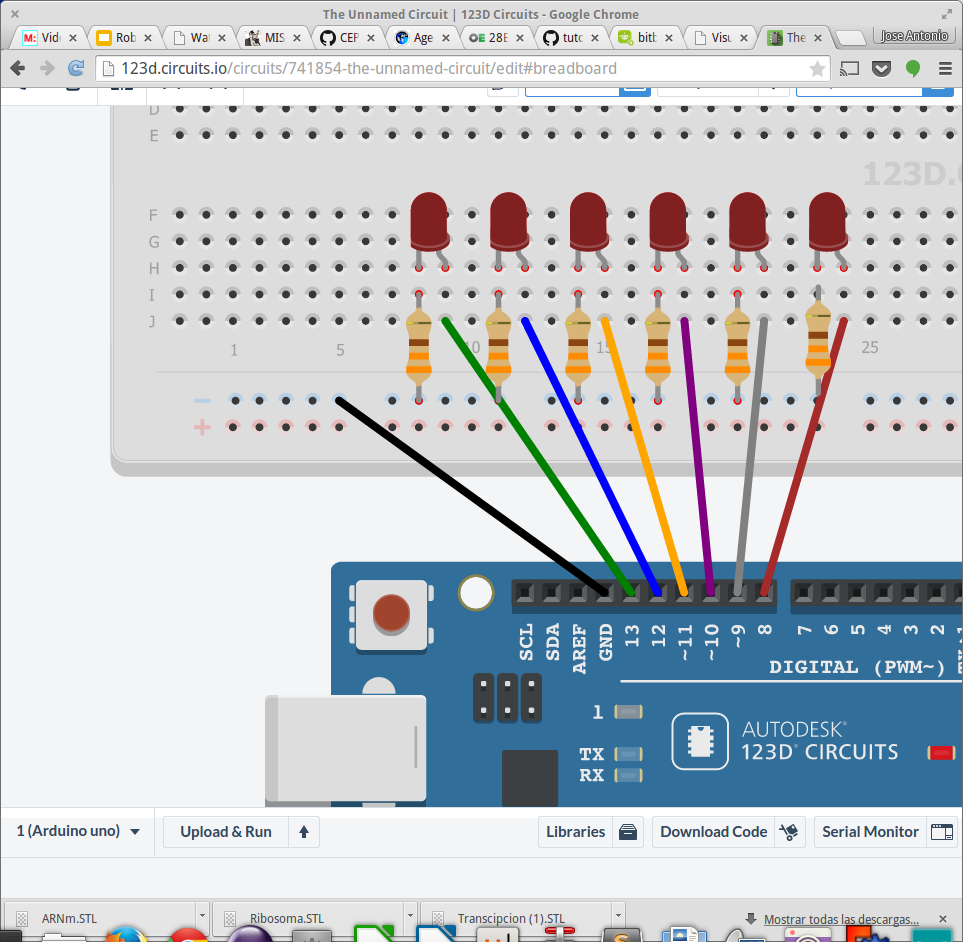
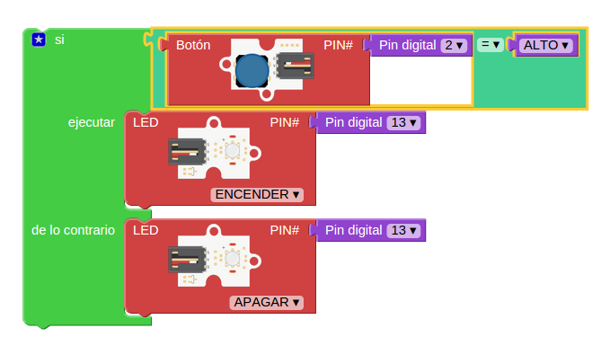
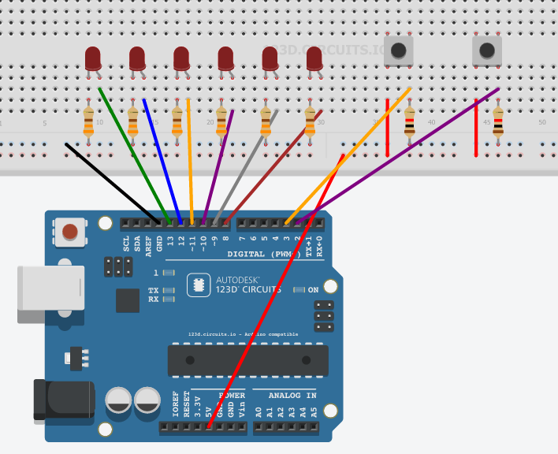
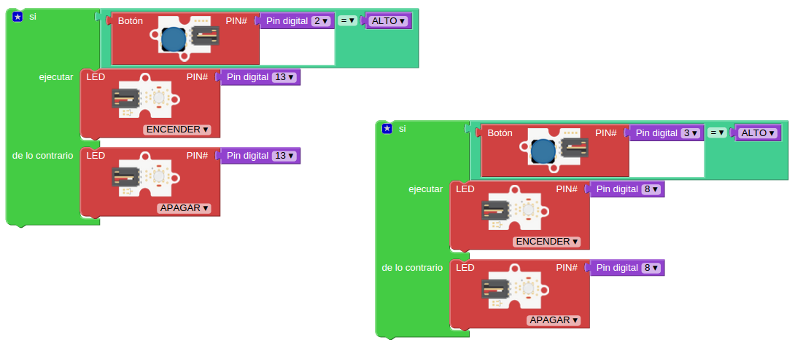
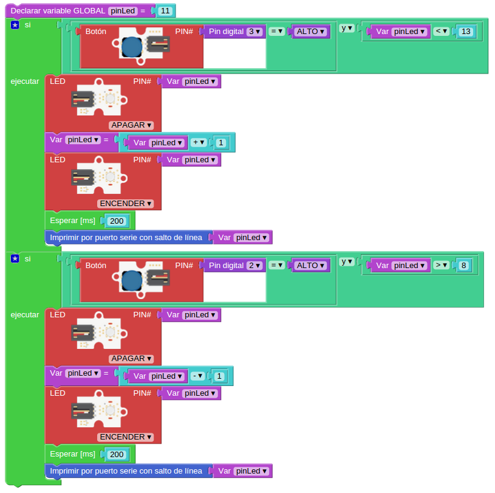

# Arduino: Nivel avanzado

## José Antonio Vacas @javacasm
## Darwin Eventur

## Facultad de ciencias
## 13 al 17 de Julio de 2015 
##								#ARDUINO2015

***

<!-- background: #184bc6-->
<!-- color: #fff -->
<!-- font: centurygothic -->

# Indicador de temperatura (sensor de temperatura)
(podemos usar cualquier sensor de temperatura)

* * * 

# KIT (registro de desplazamiento)
#### Vamos a encender varios leds de forma consecutiva imitando el efecto que hacía Kit, el coche fantástico

Usaremos una variable que nos irá diciendo el led que se ha de encender en cada paso.

### montaje

* * *
# Variables globales

Vamos a usar variables globales para hacer un bucle .

* ContadorVueltas nos dirá el número de iteraciones que ha hecho nuestro programa

* * *
## Números aleatorios

Podemos generar valores aleaotrios con el bloque "Aleatorio" al que le diremos entre qué valores ha de generar los valores. El valor máximo no se alcanza, por lo que si queremos que se incluya tendremos que incrementar el máximo.

Este programa llamado "Discotequero" hace parpadear los leds aleatoriamente durante un tiempo también aleatorio

* * *

Cambiaremos nuestro programa "Aleatorio" para que el tiempo de espera con el led encendido sea proporcional al valor de espera del led encendido

* * *

# Pulsaciones: botones

## Montaje 

## Programa

### Usamos una sentencia condicional: si se cumple esto...se hace aquello

### Su código

	void setup()
	{
	  pinMode(2,INPUT_PULLUP);  // Usamos 2 como entrada
	  pinMode(13,OUTPUT);		// Usamos 13 como salida
	}

	void loop()
	{
	  if (digitalRead(2) == HIGH)  	// Si el pulsador está pulsado
	  {
	    digitalWrite(13,HIGH);		//Encendemos el led 13
	  }
	  else 							// Si NO se cumple
	  {		
	    digitalWrite(13,LOW);		// Lo apagamos
	  }
	}

* * *
## 2 Pulsadores

Vamos usar 2 pulsadores para mover el led que encenderemos: un pulsador hará que se encienda el led anterior, el otro hará que se encienda el siguiente.

Para ello haremos el siguiente montaje con 6 leds (con resistencias de 330 Ohmios)y 2 pulsadores (con resistencias de 10k)

### Paso 1: 2 pulsadores encienden 2 leds

Empezaremos haciendo un programa que controle 2 leds con 2 pulsadores: cada uno enciende un led

### Paso 2: 2 pulsadores que irán encendiendo el led siguiente o el anterior

Utilizamos una variable que vamos incrementando con un pulsador y con otro decrementamos

(Hay que controlar que cuando lleguemos a un extremo no nos pasemos)

Se añade un retardo para evitar que se detecten varias pulsaciones.

Vemos que hay muchos bloque que se repiten, por lo que para facilitarlo definiremos funciones.

* * * 

## Vamos a rehacer el programa usando acceso directo a los puertos

[pinout detallado de las placas](http://www.pighixxx.com/test/pinoutspg/boards/)